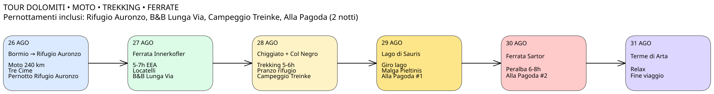

# 🏍️ Tour Dolomiti 2026



## Trekking, Ferrate e Mototurismo

# 📅 26 Agosto

## Bormio → Rifugio Auronzo

### 🏍️ Trasferimento Moto

- Distanza: ~240 km
- Tempo di percorrenza: 5-6 ore

### 🥾 Attività

Passeggiata panoramica alle Tre Cime:

- Rifugio Auronzo
- Forcella Lavaredo
- Panorama al tramonto

**Durata:** 1h30 - 2h

> ## 🌙 PERNOTTAMENTO
>
> ### Rifugio Auronzo
>
> 📍 Tre Cime di Lavaredo
> ⛰️ Quota: 2.333 m

### 💰 Spese

- Pernottamento: € **\_\_**

---

# 📅 27 Agosto

## Ferrata De Luca - Innerkofler

### 🥾 Ferrata

- Durata: 5-7 ore
- Dislivello: 600 m
- Difficoltà: EEA

Percorso:

- Rifugio Auronzo
- Rifugio Locatelli
- Gallerie della Grande Guerra
- Cima Paterno
- Rientro al Rifugio Auronzo

### 🏍️ Trasferimento

Rifugio Auronzo → B&B Lunga Via delle Dolomiti

**Tempo:** 1h - 1h30

> ## 🌙 PERNOTTAMENTO
>
> ### B&B Lunga Via delle Dolomiti

### 💰 Spese

- Pernottamento: € **\_\_**

---

# 📅 28 Agosto

## Rifugio Chiggiato e Col Negro

### 🥾 Trekking

- Salita al Rifugio Chiggiato: 2h
- Chiggiato → Col Negro: 1h30
- Dislivello: 800-900 m
- Durata complessiva: 5-6 ore

### 🍝 Pranzo

Rifugio Chiggiato

### 🏍️ Trasferimento

Chiggiato → Sauris

**Tempo:** circa 1h30

> ## 🌙 PERNOTTAMENTO
>
> ### Campeggio Treinke Sauris
>
> 📍 Sauris

### 💰 Spese

- Campeggio: € **\_\_**

---

# 📅 29 Agosto

## Lago di Sauris

### 🥾 Trekking Possibili

#### 1. Giro del Lago di Sauris

- Durata: 2-3 ore
- Difficoltà: T

#### 2. Sauris di Sopra ↔ Sauris di Sotto

- Durata: 3-4 ore
- Difficoltà: E

#### 3. Malga Pieltinis

- Durata: 4-5 ore
- Difficoltà: E

#### 4. Monte Ruke

- Durata: 4-5 ore
- Difficoltà: E

### 🏍️ Trasferimento

Sauris → Enemonzo

**Tempo:** 45 minuti

> ## 🌙 PERNOTTAMENTO (1ª NOTTE)
>
> ### Alla Pagoda
>
> 📍 Via Maiaso 2
> 33020 Enemonzo (UD)

### 💰 Spese

- Pernottamento: € **\_\_**

---

# 📅 30 Agosto

## Ferrata Sartor al Monte Peralba

attacco (gpx)

> https://maps.google.com/maps?daddr=46.62029%2C+12.71606

### 🏍️ Trasferimento

Enemonzo → Monte Peralba

**Tempo:** 1h15

### 🥾 Ferrata Sartor

- Durata: 6-8 ore
- Difficoltà: EEA
- Kit ferrata obbligatorio

### 💰 Spese

- Colazione: € **\_\_**
- Pranzo: € **\_\_**
- Cena: € **\_\_**
- Carburante: € **\_\_**

> ## 🌙 PERNOTTAMENTO (2ª NOTTE)
>
> ### Alla Pagoda
>
> 📍 Via Maiaso 2
> 33020 Enemonzo (UD)

---

# 📅 31 Agosto

### Stolvizza (Val Resia)

- Visita del borgo storico resiano, il più rappresentativo della valle.
- Trekking **Ta Lipa Pot**
  - 8,3 km
  - 2h50
  - dislivello 200 m
  - percorso ad anello tra cascate, passerelle e panorami sul Monte Canin

### 🏍️ Trasferimento

### 💰 Spese

- Ingresso terme: € **\_\_**
- Pranzo: € **\_\_**

### 🏍️ Trasferimento

```text
Stolvizza
↓
Resiutta
↓
Tolmezzo
↓
Forni Avoltri
↓
Sappada
↓
San Candido
↓
Vicino Brunico
```

- circa 3 ore di guida
- percorso molto panoramico

### 🌆 Pomeriggio a Brunico

- Centro storico
- Via Centrale
- Castello di Brunico
- Messner Mountain Museum Ripa

### 🌙 Pernottamento

> **Tree Tent Ombretta Experience**
> Località Malga Ciapela, 32023 Rocca Pietore BL, Italy

---

# 📅 1 Settembre

## Brunico → Lago di Tovel → Val di Non

### 🏍️ Trasferimento

```text
Brunico
↓
Bressanone
↓
Passo delle Palade
↓
Val di Non
↓
Lago di Tovel
```

### 🥾 Trekking

#### Opzione A

**Giro del Lago di Tovel**

- 2 ore
- facile

#### Opzione B

**Rifugio Tuena**

- 5-6 ore
- panoramico
- poco frequentato

### 🌙 Pernottamento

**Val di Non**
 >hotel rosa - Via De Zinis 31, 38011 Cavareno, Italy

---

# 📅 2 Settembre

## Val di Non → Lago di Resia → Bormio

### 🏍️ Percorso panoramico consigliato

```text
Val di Non
↓
Passo della Mendola
↓
Merano
↓
Val Venosta
↓
Curon Venosta
↓
Lago di Resia
↓
Passo dello Stelvio
↓
Bormio
```

### 📸 Tappa principale

**Campanile Sommerso di Curon Venosta**

- passeggiata lungolago
- punti fotografici sul campanile
- visita del borgo di Curon

### 🥾 Possibile passeggiata

**Giro parziale del Lago di Resia**

- 1-2 ore
- facile
- ottimi panorami

# 🌙 RIEPILOGO PERNOTTAMENTI

| Data      | Struttura                        |
| --------- | -------------------------------- |
| 26 Agosto | 🏔️ Rifugio Auronzo               |
| 27 Agosto | 🛏️ B&B Lunga Via delle Dolomiti  |
| 28 Agosto | ⛺ Campeggio Treinke Sauris      |
| 29 Agosto | 🏨 Alla Pagoda                   |
| 30 Agosto | 🏨 Alla Pagoda                   |
| 31 Agosto | ⛺ Tree Tent Ombretta Experience |
| 01 Agosto | ??                               |

# 🗺️ GPX

- day1_panorama.gpx
- day2_innerkofler.gpx
- day3_chiggiato.gpx
- day4_sauris.gpx
- day5_peralba.gpx
- day6_arta.gpx
